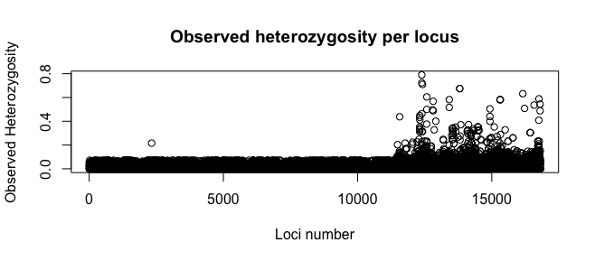
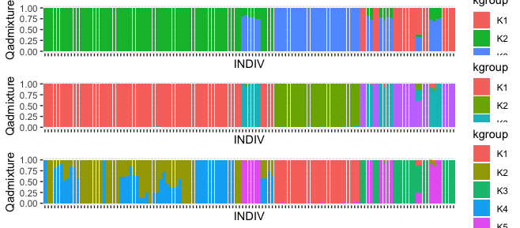

## Diversidad genética y estructura poblacional de cuatro poblaciones de *Capsicum annuum* L.

En este trabajo se uso el archivo vcf tomado de: Genomewide genotyping of a novel Mexican Chile Pepper collection illuminates the history of landrace differentiation after Capsicum annuum L. domestication. Dryad Digital Repository [https://doi.org/10.5061/dryad.f1782h7](https://datadryad.org/resource/doi:10.5061/dryad.f1782h7), para el análisis diversidad genética y estructura poblacional, solo se seleccionaron las cuatro principales poblaciones de *Capsicum annuum* L. que crecen en Oaxaca: Tusta, Taviche, Costeño y Chile de Agua.

El filtrado de SNPs y generación del archivo vcf realizó con el programa VCFTools v 0.1.5 (Danecek et al., 2011) en total se analizaron 125 individuos y 16815 SNPs.

La heterocigosidad esperada (Hexp) y observada (Hobs) se calculó con el paquete de R Hierfstat (Goudet, 2005) y se obtuvieron valores de 0.26 y 0.03 respectivamente para todo el set de datos. La figura 1 muestra la heterocigosidad observada por locus.

La diferenciación entre poblaciónes se realizó con Fst pareada en el paquete de R Hierfstat (Goudet, 2005) y los valores van desde 0.1099 entre Taviche y Tusta y de 0.5695 entre Tusta y Chile de Agua(Tabla 1). Se observa que las poblaciones Taviche y Tusta son las más similares entre si, mientras que Tusta y Chile de Agua son las mas diferenciadas.
La FST promedio para todas las poblaciones fue de 0.6290 y el FIS de 0.8245.

** Tabla 1. FST entre pares de poblaciones** 

|  |      Chile de Agua  |  Tusta|		Costeño	|
|----------|:-------------:|------:|-------:|
| Tusta| 0.5695  |  |		|
| Costeño |    0.3827   |   0.4892 |		|
| Taviche | 0.2894 |    0.1099 |	0.2385	|

Para inferir la estructura de las poblaciones se uso el software ADMIXTURE v 1.3.0 (Alexander et al., 2009) el análisis se realizó con diferentes números de poblaciones predefinidas que van desde K = 1 a K = 5. La K óptima fue de 5.

Las distancias genéticas fueron calculadas con el paquete de R Adegenet (Jombart, 2008). El fenograma generado con las distancias genéticas fue visualizado mediante el método Neighbor-Joining y mostró que las poblaciones estan divididas en tres grupos principales.

## Referencias
+ Alexander, D. H., Novembre, J., & Lange, K. (2009). Fast model-based estimation of ancestry in unrelated individuals. Genome research, 19(9), 1655-1664.
+ Danecek, P., Auton, A., Abecasis, G., Albers, C. A., Banks, E., DePristo, M. A., Handsaker, R., Lunter, G., Sherry, T. S., & McVean, G. (2011). The variant call format and VCFtools. Bioinformatics, 27(15), 2156-2158.
+ Goudet, J. (2005). Hierfstat, a package for R to compute and test hierarchical F‐statistics. Molecular Ecology Notes, 5(1), 184-186
+ Jombart T (2008) Adegenet: a R package for the multivariate analysis of genetic markers. Bioinformatics, 24, 1403–1405.

