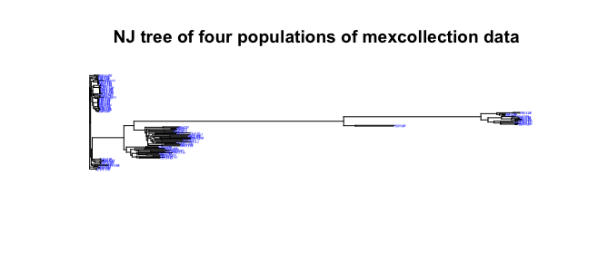

# Resumen
Para este trabajo se tomaron datos de el articulo ...y se tomaron cuatro poblaciones Chile de agua, Costeño, Taviche y Tusta

| Población  |      n     |  SNPs |		He	|
|----------|:-------------:|------:|-------:|
| Taviche|  10 | 15558|		|
| Costeño |    26   |   4753 |		|
| Tusta | 19 |    23956 |		|
| Chile de Agua| 70 |    2825 |		|

**Pairwise FST** 

|  |      Chile de Agua  |  Tusta|		Costeño	|
|----------|:-------------:|------:|-------:|
| Tusta| 0.7934017  |  |		|
| Costeño |    0.6038192   |   0.6486306 |		|
| Taviche | 0.6380730 |    0.1533114 |	0.4042553	|

###NJ tree

