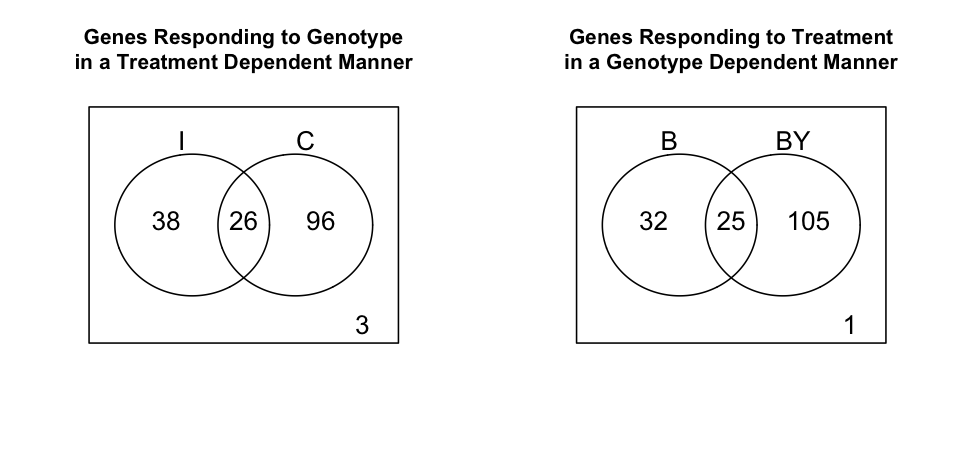

## Introducción a la bioinformática e investigación reproducible para análisis genéticos
### Tarea 7.1 Expresión diferencial
### Gabriela Alcalá Gómez

#### Introducción

Los microarreglos de ADN se realizan en chips con una serie de sondas de ADN unidas a un soporte sólido. Son usados para determinar la expresión genética de un tejido. Se realizaron experimentos con dos diferentes genotipos de ratones para analizar la expresión de genes en el músculo cardíaco. 
En esta tarea los objetivos fueron, determinar si existe expresión diferencial entre los genotipos y tratamientos. Determinar si existen diferencias en la respuesta al tratamiento de los dos genotipos. 

#### Metodología

Los genotipos usados fueron B y BY. A los genotipos se aplicaron dos tratamietos: Castarados (C) e intactos (I) y el ARN se hibridizó en BeadChips de Illumina. 
La distribución de los genotipos con los diferentes tratamietos fue aleatorizada en el chip. Se seleccionaron solamente 5000 sondas para este trabajo.
Los análisis se realizaron el en programa R v 3.6 con diversos paquetes.

#### Resultados
La caliad de las sondas analizadas se muestra en la figura 1. donde se puede apreciar en las cajas verdes las sondas de buena caliad, mientras que las de mala calidad son las cajas rojas. La figura 2 muestra las calidades por tratamientos C e I.

Existen 1012 genes que no estan diferenciados por ningun factor (genotipo, tratamiento, interacción)y 49 que estan diferenciados por los tres factores (Figura 3). El número de genes con interacción entre tramatientos fue de 26 y entre genotipos 25 (Figura 4).

 

Figura 1. Boxplot de los datos sin procesar.

Figura 2. Box plot de los datos por tratamiento.

 

Figura 3. Expresión deferencial de Genes e interacciones. 

Figura 4. Expresión diferencial de genes entre tratamienetos (I, C) y genotipos (B y BY).

#### Conclusiones
Con este análisis se se comprobó que si existe expresión diferencial entre los genótipos y también entre los tratamientos. Se observa que existen mas genes con expresión diferencial entre los genotipos (B y BY) que entre los tratamientos.

