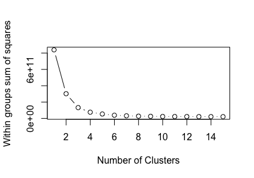
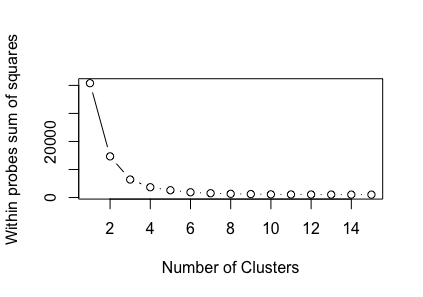
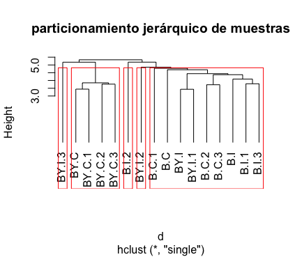

## Introducción a la bioinformática e investigación reproducible para análisis genéticos
### Tarea 7.2 Analisis funcional de datos de microarreglos
### Gabriela Alcalá Gómez

#### Introducción

Se realizaron experimentos con dos diferentes genotipos de ratones para analizar la expresión de genes en el músculo cardíaco. Una vez realizado el análisis de expresión diferencial de genes en las muestras, el siguiente paso es hacer una clasificación de los genes para agrupar aquellos genes que son mas similares entre si. En esta tarea los objetivo fue analizar la matriz de datos de expresión diferencial para detectar detectar grupos de genes.

#### Metodología

En este análisis se usó el archivo normdata.txt que contiene los datos de 5000 sondas con genes diferencialmente expresados.
Los análisis se realizaron el en programa R v 3.6.
Se generó una gráfica de la suma de cuadrados para determinar el número de grupos y se realizó el agrupamiento jerárquico, para muestras y sondas. 

#### Resultados
Los gráficos de la suma de cuadrados por muestra y por sondas se muestran en las  Figuras 1 y 2, se determinó un K = 5 para ambos casos. En el particionamiento jerárquico para las muestras (Figura 3) se puede observar en el grupo tres que los genes pertenecen a los genotipos BY y al tratamiento C y el el grupo cincoo hay una combinación de genotipos y tratamientos. 

 
Figura 1. Suma de cuadrados por muestra.

Figura 2. Suma de cuadrados por sondas.

 
Figura 3. Particionamiento jerárquico de muestras

#### Conclusiones
Con este análisis se observó que los genes expresados en el genotipo BY y tratamiento C, son muy similares entre si. 

